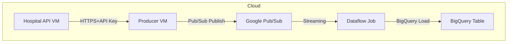

# 🏥 Hospital Streaming API Component

> **Enterprise-Grade Flask API for Secure, Auditable, and Cloud-Native Healthcare Data Ingestion**

---

## 📌 Overview

This project provides secure, production-ready REST API endpoints for hospital patient, appointment, and lab result data. It is designed to fit into a real-world, GCP-based data engineering pipeline—serving as the entry point for data streaming into Pub/Sub and BigQuery.

* **Framework:** Flask (Python 3.11+)
* **Production Host:** Gunicorn (WSGI)
* **Cloud:** Google Cloud Platform (GCP)
* **Secrets:** Google Secret Manager (GSM)
* **Authentication:** Per-endpoint API keys (GSM)
* **Integration:** Supports external producer → Pub/Sub → Dataflow → BigQuery

---

## 🚀 Features

* 🔐 **API Key Security:** Each API is protected by a unique API key stored in GSM, never in code.
* 🏥 **Multiple Endpoints:**

  * `/patients`  – patient master data
  * `/appointments` – appointment transactions
  * `/lab_results`  – patient lab reports
* 📄 **Auditable Payloads:** All responses include required audit columns for compliance.
* ☁️ **Cloud Native:** Deploy-ready for GCP VMs, CI/CD, Docker, Cloud Run.
* 🔄 **Easily Extendable:** Modular shared code, config-driven endpoints.

---

## 📂 Directory Structure

```
hospital-streaming-pipeline/
├── api/
│   ├── appointments_api.py
│   ├── lab_results_api.py
│   ├── patients_api.py
│   └── shared_module/
│       ├── auth.py
│       ├── logger.py
│       ├── schemas.py
│       └── utils.py
├── config/
│   ├── dev_config.yaml
│   └── example.env
├── requirements.txt
└── README.md
```

---

## 🔧 Quickstart: Local or GCP VM

### 1. **Clone Repo & Set Up Python**

```bash
git clone <REPO_URL>
cd hospital-streaming-pipeline
python3.11 -m venv venv
source venv/bin/activate
pip install -r requirements.txt
```

### 2. **Generate & Upload API Keys to GSM**

```bash
openssl rand -hex 32 > patients_api_key.txt
# (repeat for other endpoints)
gcloud secrets create patients_api_key --replication-policy="automatic"
gcloud secrets versions add patients_api_key --data-file=patients_api_key.txt
```

### 3. **Export Secret IDs and Start APIs**

```bash
export PATIENTS_API_KEY_SECRET_ID="projects/<YOUR_PROJECT_ID>/secrets/patients_api_key/versions/latest"
gunicorn -w 2 -b 0.0.0.0:5001 api.patients_api:app &
```

---

## 🔑 Authentication Pattern

* Every API call requires the correct `x-api-key` header.
* Key is securely fetched from GSM at startup.
* Sample usage:

  ```bash
  curl -H "x-api-key: <API_KEY>" http://<EXTERNAL_IP>:5001/patients
  ```

---

## 🏗️ GCP Integration & Enterprise Flow



---

## 📑 Sample API Contract (OpenAPI-like)

### **GET /patients**

* Returns: Array of patient objects
* Fields: `patient_id`, `name`, `dob`, `created_ts`, `updated_ts`, ...

### **GET /appointments**

* Returns: Array of appointment objects
* Fields: `appointment_id`, `patient_id`, `date`, `created_ts`, ...

---

## 🛡️ Security, IAM, & Compliance

* Only VMs with IAM `roles/secretmanager.secretAccessor` can fetch API keys.
* All access logged via GCP Cloud Logging.
* Supports audit columns: `created_ts`, `updated_ts`, `created_by`, `is_active`.
* Recommended: Restrict firewall ports to producer/office IPs, always use HTTPS in production.

---

## 🧰 Advanced: Container, CI/CD & Systemd

* **Docker-ready**: Add a `Dockerfile` to containerize and deploy anywhere.
* **CI/CD**: Plug into Cloud Build, GitHub Actions, etc.
* **Systemd**: Run each Gunicorn API as a system service for uptime.

---

## 📝 Interview/Architecture Keywords

GSM, Pub/Sub, Gunicorn, Flask, Cloud Logging, Audit Columns, API Key Rotation, Containerization, GCP IAM, Health Data Compliance.

---

## 🙋 FAQ

* **API not reachable?** Check VM firewall, Gunicorn process, and port.
* **Permission denied on GSM?** Confirm service account and IAM.
* **Wrong key?** Rotate in GSM, restart API.

---

## 📢 Authors & Contact

* **Project Lead:** Jithendra Gunuru
* **Contact:** [jithendra.gunuru2016@gmail.com](mailto:jithendra.gunuru2016@gmail.com)
* **For feedback or issues:** Open a GitHub issue or email above.

---
