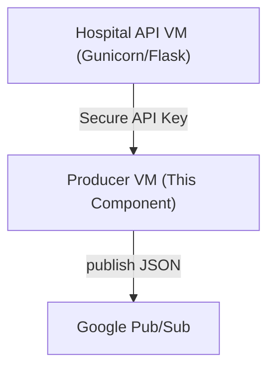

# 🚀 Producer Scripts – API to Pub/Sub Component

> **GCP-Ready Producer Scripts for Secure API Fetch with GSM Key & Pub/Sub Publishing**

---

## 📌 Overview

This component provides Python scripts to securely fetch data from the hospital API endpoints (protected by API keys in GSM) and publish to Google Cloud Pub/Sub topics.\
It is designed for robust, auditable, and cloud-native data streaming pipelines.

- **Language:** Python 3.11+
- **Security:** Google Secret Manager (API Key)
- **Transport:** HTTPS (requests)
- **Target:** Google Cloud Pub/Sub (Streaming)
- **Usage:** Fits into any modern GCP streaming or batch ETL flow.

---

## 🖥️ VM Setup, Firewall & Permissions (GCP & Local)

### 1. **VM Creation (GCP)**

- Use a **Debian/Ubuntu** image with at least 2 vCPUs and 4GB RAM for production streaming.
- Assign a **service account** with the following roles:
  - `roles/secretmanager.secretAccessor`
  - `roles/pubsub.publisher`
- Enable required APIs:
  ```bash
  gcloud services enable secretmanager.googleapis.com pubsub.googleapis.com
  ```

### 2. **Firewall Rules**

- **Outbound (egress):** Open by default. Needed for:
  - HTTPS (443) to Google APIs (GSM, Pub/Sub)
  - HTTP (80) if your APIs run on HTTP (dev/test)
- **Inbound (ingress):**
  - **SSH (22):** Open only to your trusted IPs for admin
  - **No public inbound ports needed** for Producer unless you expose an API/UI (not typical).

### 3. **Local VM/Server (Non-GCP)**

- Ensure outbound access to:
  - `*.googleapis.com:443` (GCP APIs)
  - API VM IP/port (e.g., `:5001`, `:5002`, `:5003`)
- If using a proxy/firewall, whitelist the above.

### 4. **Permissions Checklist**

- **Producer Service Account** must have:
  - `roles/secretmanager.secretAccessor`
  - `roles/pubsub.publisher` for your target Pub/Sub topics
- **API VM Firewall:** Allow traffic **from Producer VM’s IP** to ports 5001–5003.

---

### 📦 **Summary Table**

| Resource/Port         | Direction | Rule/Permission                      | Why                             |
| --------------------- | --------- | ------------------------------------ | ------------------------------- |
| SSH (22)              | Inbound   | Open to admin IPs                    | Remote VM admin                 |
| GSM, Pub/Sub (443)    | Outbound  | Open (default in GCP)                | Cloud API access (GSM, Pub/Sub) |
| Hospital API (5001-3) | Outbound  | Open to API VM IPs                   | Fetch data from API             |
| SecretManager Access  | -         | `roles/secretmanager.secretAccessor` | Fetch API keys                  |
| Pub/Sub Publisher     | -         | `roles/pubsub.publisher`             | Publish messages                |

---

## 📂 Directory Structure

```
producer/
├── producer_patients.py
├── producer_appointments.py
├── producer_lab_results.py
├── shared/
│   ├── config_util.py        # Loads config.yaml
│   ├── fetch_api_key.py      # Fetches key from GSM
│   └── config.yaml           # Stores API URLs and Pub/Sub topic names
└── requirements.txt
```

---

## 🛠️ Setup & Quickstart

> **Security Best Practice:**\
> Always export `API_KEY_SECRET_ID` (the full GSM secret resource path) as an environment variable on your Producer VM **before running any script**. This ensures your code fetches the API key securely from Google Secret Manager and never from local files or code.

### 1. **Clone & Prepare Python Environment**

```bash
cd producer
python3.11 -m venv venv
source venv/bin/activate
pip install -r requirements.txt
```

### 2. **Configure API URLs, Topics, and GSM Secret**

- Edit `shared/config.yaml`:
  ```yaml
  api:
    patients_url: "http://<API_VM_IP>:5001/patients"
    appointments_url: "http://<API_VM_IP>:5002/appointments"
    lab_results_url: "http://<API_VM_IP>:5003/lab_results"
  pubsub:
    patients_topic: "projects/<PROJECT_ID>/topics/patients-stream"
    appointments_topic: "projects/<PROJECT_ID>/topics/appointments-stream"
    lab_results_topic: "projects/<PROJECT_ID>/topics/lab-results-stream"
  ```
- Set your **API Key GSM secret path** as an environment variable:
  ```bash
  export API_KEY_SECRET_ID="projects/<PROJECT_ID>/secrets/hospital-api-key/versions/latest"
  ```

### 3. **Run Producer Scripts**

```bash
python producer_patients.py
python producer_appointments.py
python producer_lab_results.py
```

---

## 🔑 How Secure API Key Fetch Works

- API key is never hardcoded—always read securely from GSM using the env variable.
- Code in `shared/fetch_api_key.py`:
  ```python
  import os
  from google.cloud import secretmanager

  def get_api_key():
      secret_id = os.environ["API_KEY_SECRET_ID"]
      client = secretmanager.SecretManagerServiceClient()
      response = client.access_secret_version(request={"name": secret_id})
      return response.payload.data.decode('UTF-8')
  ```
- All requests to API endpoints use the `"x-api-key"` header.

---

## 🏗️ End-to-End Data Flow



---

## 📦 requirements.txt

This covers **all packages imported in every script in this component**:

```
requests
google-cloud-secret-manager
google-cloud-pubsub
pyyaml
```

> Install with: `pip install -r requirements.txt`

---

## 🧑‍💻 Example Usage (Python)

```python
# From producer_patients.py
from shared.config_util import load_config
from shared.fetch_api_key import get_api_key
import requests

config = load_config()
API_URL = config['api']['patients_url']
API_KEY = get_api_key()
resp = requests.get(API_URL, headers={"x-api-key": API_KEY})
data = resp.json()["patients"]
```

---

## 🔒 Security & IAM Checklist

- Producer VM/service account must have:
  - `roles/secretmanager.secretAccessor`
  - `roles/pubsub.publisher` on the correct topics
- **Never commit API keys or secrets.**
- All configs/env variables should be treated as sensitive.

---

## ❓ FAQ

- **ImportError?** Run `pip install -r requirements.txt` inside the venv.
- **GSM permissions error?** Double-check service account and IAM roles.
- **Pub/Sub publish error?** Check topic names and IAM role.

---

## 📢 Authors & Support

- **Maintainer:** Jithendra Gunuru
- **Email:** [jithendra.gunuru2016@gmail.com](mailto\:jithendra.gunuru2016@gmail.com)

---

